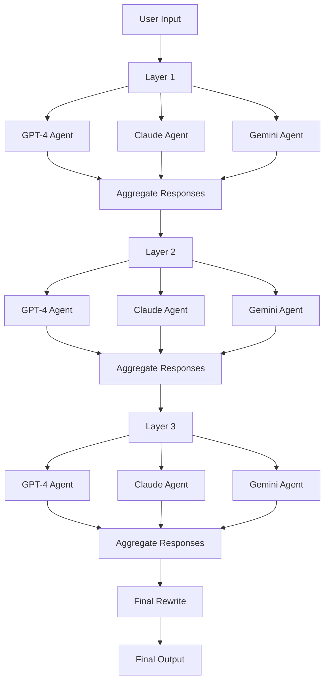

# Mixture of Agents (MoA) Implementation

## Introduction
This project implements a Mixture of Agents (MoA) model, a novel approach to leveraging multiple Large Language Models (LLMs) to enhance reasoning and language generation capabilities. The implementation is based on the paper "Mixture-of-Agents Enhances Large Language Model Capabilities" by Wang et al. (2024).

## How It Works

Our MoA implementation utilizes a multi-layer architecture with multiple LLM agents in each layer. The current setup includes:

- Three types of LLM agents:
    - GPT-4 (OpenAI)
    - Claude 3.5 Sonnet (Anthropic)
    - Gemini Pro 1.5 (Google)
- Multiple processing layers (configurable, default is 3)

With the aim to achieve a best-in-clasee performance level through use of leading edge models

## Architecture Diagram



This architecture allows for:

- Iterative refinement of responses through multiple layers
- Leveraging strenths of different LLMs
- Sophisticated aggregation of diverse model outputs

## Process Flow:

1. The user input is fed into the first layer.
2. In each layer:
 - ALl agents process the input simultaneuously.
 - Responses from all agents are aggregated using Claude as a synthesizer.
3. The aggregated output becomes the input for the next layer.
4. This process repeates through all layers.
5. A final rewrite step ensures the response is coherent and directly addresses the user's prompt.

## Features

**Color-Coded CLI Output**
The CLI displays color-coded outputs for each agent in each layer:

Red: GPT-4
Green: Claude
Yellow: Gemini

This feature allows for easy visual distinction between different agents' responses.

**Full Text Display**
The CLI now shows the full text of each agent's response at each layer, providing a comprehensive view of the reasoning process.

**HTML Report Generation**
After each interaction, an HTML report (moa_report.html) is generated, containing:

- The original prompt
- Full responses from each agent at each layer
- The final synthesized response

The HTML report uses color-coding for easy readability:

- Light red background: GPT-4 responses
- Light green background: Claude responses
- Light blue background: Gemini responses
- Light cyan background: Final synthesized response

This report is useful for in-depth analysis of the MoA process and for sharing results.

## Installation
Follow these steps to set up the project:

1. Clone the repository:
```python
git clone https://github.com/yourusername/moa-implementation.git
cd moa-implementation
```

2. Ensure you have Docker installed on your system.

3. Create a `.env` file in the project root directory with your API keys:
```markdown
OPENAI_API_KEY=your_openai_api_key
ANTHROPIC_API_KEY=your_anthropic_api_key
GOOGLE_API_KEY=your_google_api_key
```

## Running the Model
To run the MoA model:

1. Build the Docker image:
```bash
docker build -t moa_project
```
2. Run the Docker container:
```bash
docker run -it --env-file .env -v "$(pwd)":/app moa_project
```

This will start an interactive session where you can enter prompts and receive responses from the MoA model.

## Output

After each interaction, you will see:

1. Color-coded intermediate outputs from each agent in the CLI.
2. A final synthesized response in the CLI.
3. An HTML report (`moa_report.html`) in your current directory with detailed outputs.

## Project Structure

- `moa_model.py`: The main implementation of the Mixture of Agents model.
- `Dockerfile`: Instucutre for building the Docker image.
- `environment.yml`: Conda environment specification.
- `requirements.txt`: List of Python package dependencies.
- `.env`: (You need to create this) Contains your API keys.
- `README.md`: This file, containing project information and instructions.

## Extending the Model
The current implementation provides a basic structure for the MoA model. You can extend it by:

1. Adding more diverse LLM agents.
2. Implementing more sophisticated routing based on task type or model strengths.
3. Experimenting with different aggregation methods.
4. Adjusting the number of layers or layer compositions.
5. Implementing error handling and rate limiting for API calls.
6. Optimizing performance with more advanced parallel processing techniques.

## References
Wang, J., Wang, J., Athiwaratkun, B., Zhang, C., & Zou, J. (2024). Mixture-of-Agents Enhances Large Language Model Capabilities. arXiv preprint arXiv:2406.04692v1.

## License
See the LICENSE file for details.
